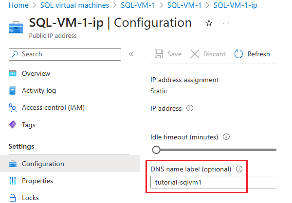

### Configure a DNS Label for the public IP address

To connect to the SQL Server Database Engine from the Internet, consider creating a DNS Label for your public IP address. You can connect by IP address, but the DNS Label creates an A Record that is easier to identify and abstracts the underlying public IP address.

> [!NOTE]
> DNS Labels are not required if you plan to only connect to the SQL Server instance within the same Virtual Network or only locally.

To create a DNS Label, first select **Virtual machines** in the portal. Select your SQL Server VM to bring up its properties.

1. In the virtual machine overview, select your **Public IP address**.

    

1. In the properties for your Public IP address, expand **Configuration**.

1. Enter a DNS Label name. This name is an A Record that can be used to connect to your SQL Server VM by name instead of by IP Address directly.

1. Select the **Save** button.

    

### Connect to the Database Engine from another computer

1. On a computer connected to the internet, open SQL Server Management Studio (SSMS). If you do not have SQL Server Management Studio, you can download it [here](/sql/ssms/download-sql-server-management-studio-ssms).

1. In the **Connect to Server** or **Connect to Database Engine** dialog box, edit the **Server name** value. Enter the IP address or full DNS name of the virtual machine (determined in the previous task). You can also add a comma and provide SQL Server's TCP port. For example, `tutorial-sqlvm1.westus2.cloudapp.azure.com,1433`.

1. In the **Authentication** box, select **SQL Server Authentication**.

1. In the **Login** box, type the name of a valid SQL login.

1. In the **Password** box, type the password of the login.

1. Select **Connect**.

    