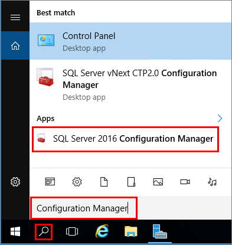
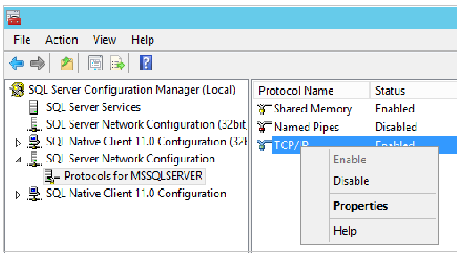

1. While connected to the virtual machine with remote desktop, search for **Configuration Manager**:

    

1. In SQL Server Configuration Manager, in the console pane, expand **SQL Server Network Configuration**.

1. In the console pane, click **Protocols for MSSQLSERVER** (the default instance name.) In the details pane, right-click **TCP** and click **Enable** if it is not already enabled.

    

1. In the console pane, click **SQL Server Services**. In the details pane, right-click **SQL Server (*instance name*)** (the default instance is **SQL Server (MSSQLSERVER)**), and then click **Restart**, to stop and restart the instance of SQL Server.

    

1. Close SQL Server Configuration Manager.

For more information about enabling protocols for the SQL Server Database Engine, see [Enable or Disable a Server Network Protocol](/sql/database-engine/configure-windows/enable-or-disable-a-server-network-protocol).