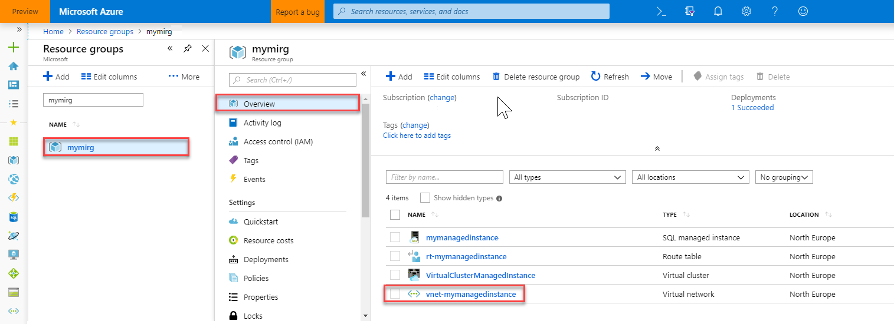
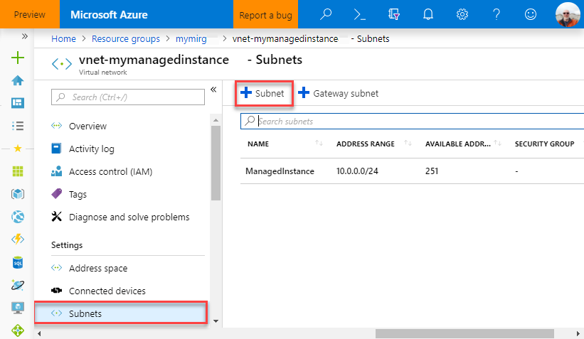
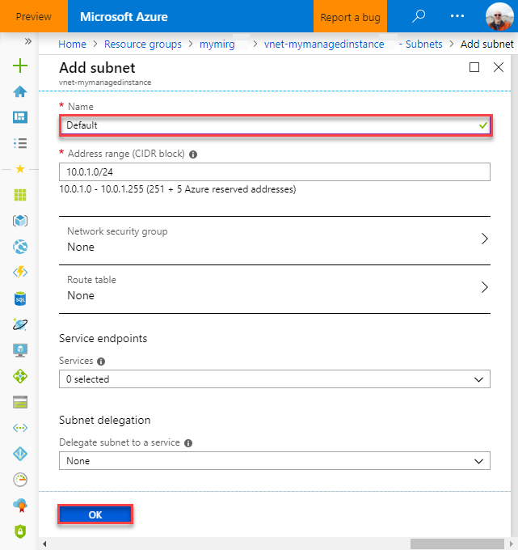
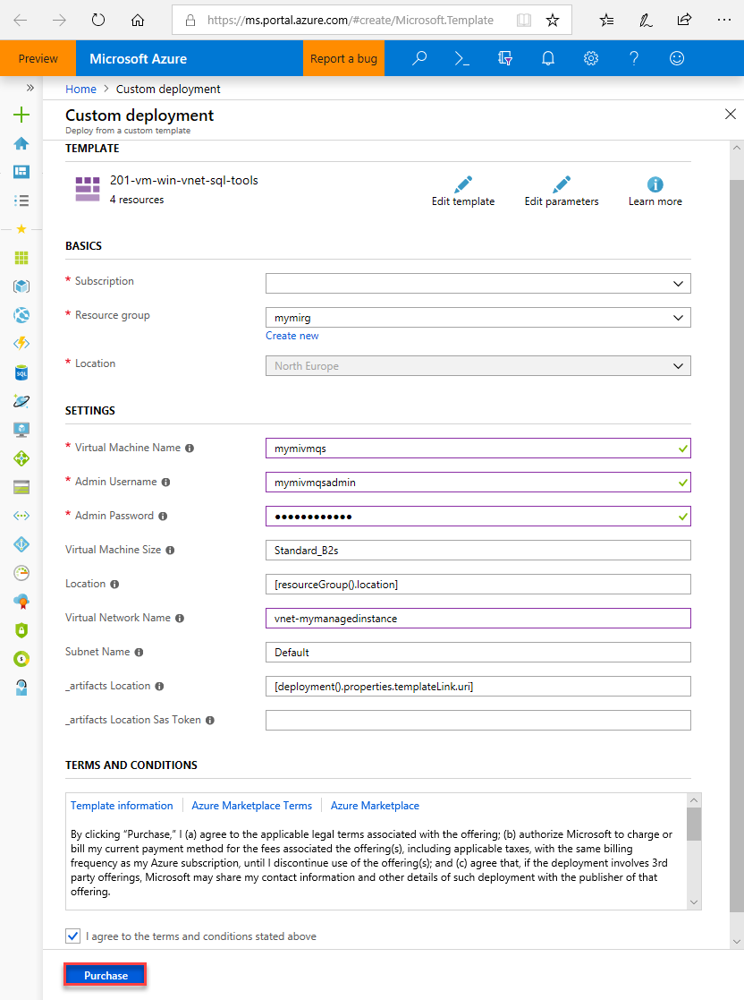
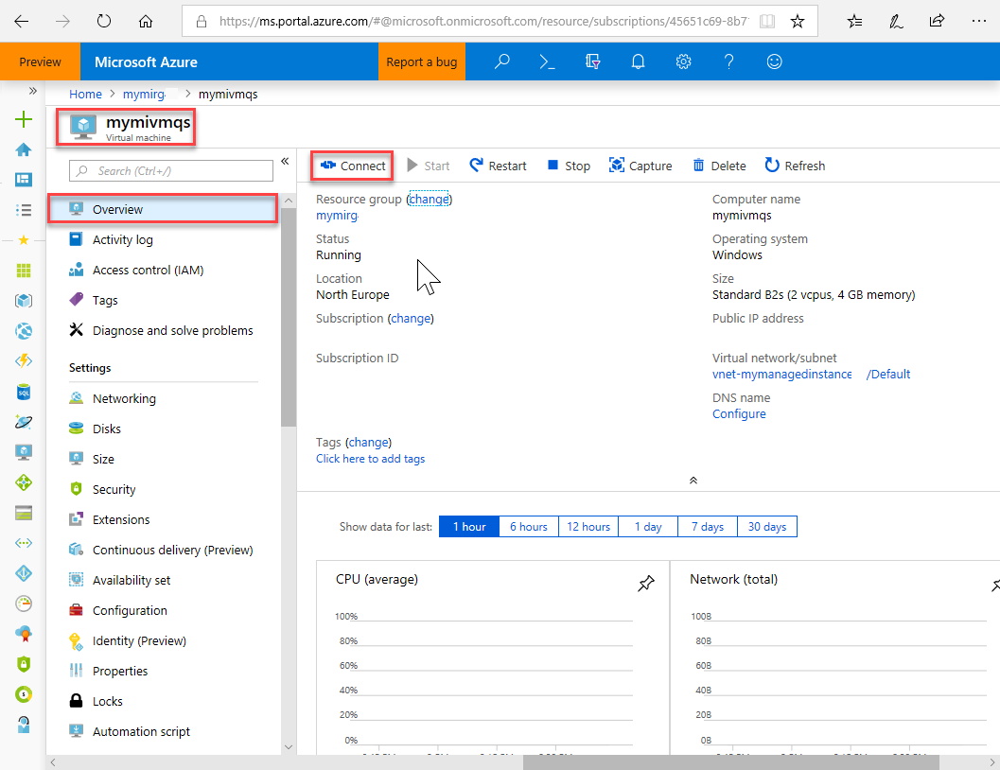
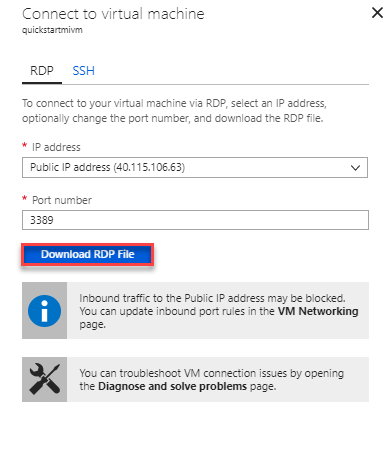
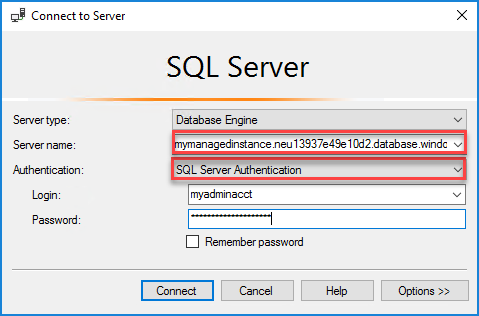

# Quickstart: Configure an Azure VM to connect to Azure SQL Managed Instance
[!INCLUDE[appliesto-sqlmi](../includes/appliesto-sqlmi.md)]

This quickstart shows you how to configure an Azure virtual machine to connect to Azure SQL Managed Instance using SQL Server Management Studio (SSMS). 

For a quickstart showing how to connect from an on-premises client computer using a point-to-site connection instead, see [Configure a point-to-site connection](point-to-site-p2s-configure.md).

## Prerequisites

This quickstart uses the resources created in [Create a managed instance](instance-create-quickstart.md) as its starting point.

## Sign in to the Azure portal

Sign in to the [Azure portal](https://portal.azure.com/).

## Create a new subnet VNet

The following steps create a new subnet in the SQL Managed Instance VNet so an Azure virtual machine can connect to the managed instance. The SQL Managed Instance subnet is dedicated to managed instances. You can't create any other resources, like Azure virtual machines, in that subnet.

1. Open the resource group for the managed instance that you created in the [Create a managed instance](instance-create-quickstart.md) quickstart. Select the virtual network for your managed instance.

   

2. Select **Subnets** and then select **+ Subnet** to create a new subnet.

   

3. Fill out the form using the information in this table:

   | Setting| Suggested value | Description |
   | ---------------- | ----------------- | ----------- |
   | **Name** | Any valid name|For valid names, see [Naming rules and restrictions](/azure/architecture/best-practices/resource-naming).|
   | **Address range (CIDR block)** | A valid range | The default value is good for this quickstart.|
   | **Network security group** | None | The default value is good for this quickstart.|
   | **Route table** | None | The default value is good for this quickstart.|
   | **Service endpoints** | 0 selected | The default value is good for this quickstart.|
   | **Subnet delegation** | None | The default value is good for this quickstart.|

   

4. Select **OK** to create this additional subnet in the SQL Managed Instance VNet.

## Create a VM in the new subnet 

The following steps show you how to create a virtual machine in the new subnet to connect to SQL Managed Instance.

## Prepare the Azure virtual machine

Since SQL Managed Instance is placed in your private virtual network, you need to create an Azure VM with an installed SQL client tool, like SQL Server Management Studio or Azure Data Studio. This tool lets you connect to SQL Managed Instance and execute queries. This quickstart uses SQL Server Management Studio.

The easiest way to create a client virtual machine with all necessary tools is to use the Azure Resource Manager templates.

1. Make sure that you're signed in to the Azure portal in another browser tab. Then, select the following button to create a client virtual machine and install SQL Server Management Studio:

   

2. Fill out the form using the information in the following table:

   | Setting| Suggested value | Description |
   | ---------------- | ----------------- | ----------- |
   | **Subscription** | A valid subscription | Must be a subscription in which you have permission to create new resources. |
   | **Resource Group** |The resource group that you specified in the [Create SQL Managed Instance](instance-create-quickstart.md) quickstart|This resource group must be the one in which the VNet exists.|
   | **Location** | The location for the resource group | This value is populated based on the resource group selected. |
   | **Virtual machine name**  | Any valid name | For valid names, see [Naming rules and restrictions](/azure/architecture/best-practices/resource-naming).|
   |**Admin Username**|Any valid username|For valid names, see [Naming rules and restrictions](/azure/architecture/best-practices/resource-naming). Don't use "serveradmin" as that is a reserved server-level role. You use this username any time you [connect to the VM](#connect-to-the-virtual-machine).|
   |**Password**|Any valid password|The password must be at least 12 characters long and meet the [defined complexity requirements](/azure/virtual-machines/windows/faq#what-are-the-password-requirements-when-creating-a-vm-). You use this password any time you [connect to the VM](#connect-to-the-virtual-machine).|
   | **Virtual Machine Size** | Any valid size | The default in this template of **Standard_B2s** is sufficient for this quickstart. |
   | **Location**|[resourceGroup().location].| Don't change this value. |
   | **Virtual Network Name**|The virtual network in which you created the managed instance|
   | **Subnet name**|The name of the subnet that you created in the previous procedure| Don't choose the subnet in which you created the managed instance.|
   | **artifacts Location** | [deployment().properties.templateLink.uri] | Don't change this value. |
   | **artifacts Location Sas token** | Leave blank | Don't change this value. |

   

   If you used the suggested VNet name and the default subnet in [creating your SQL Managed Instance](instance-create-quickstart.md), you don't need to change last two parameters. Otherwise you should change these values to the values that you entered when you set up the network environment.

3. Select the **I agree to the terms and conditions stated above** checkbox.
4. Select **Purchase** to deploy the Azure VM in your network.
5. Select the **Notifications** icon to view the status of deployment.

> [!IMPORTANT]
> Do not continue until approximately 15 minutes after the virtual machine is created to give time for the post-creation scripts to install SQL Server Management Studio.

## Connect to the virtual machine

The following steps show you how to connect to your newly created virtual machine using a Remote Desktop connection.

1. After deployment completes, go to the virtual machine resource.

      

2. Select **Connect**.

   A Remote Desktop Protocol file (.rdp file) form appears with the public IP address and port number for the virtual machine.

     

3. Select **Download RDP File**.

   > [!NOTE]
   > You can also use SSH to connect to your VM.

4. Close the **Connect to virtual machine** form.
5. To connect to your VM, open the downloaded RDP file.
6. When prompted, select **Connect**. On a Mac, you need an RDP client such as [this Remote Desktop Client](https://apps.apple.com/app/microsoft-remote-desktop-10/id1295203466?mt=12) from the Mac App Store.

7. Enter the username and password you specified when creating the virtual machine, and then choose **OK**.

8. You might receive a certificate warning during the sign-in process. Choose **Yes** or **Continue** to proceed with the connection.

You're connected to your virtual machine in the Server Manager dashboard.

## Connect to SQL Managed Instance 

1. In the virtual machine, open SQL Server Management Studio.

   It takes a few moments to open, as it needs to complete its configuration since this is the first time SSMS has been started.
2. In the **Connect to Server** dialog box, enter the fully qualified **host name** for your managed instance in the **Server name** box. Select **SQL Server Authentication**, provide your username and password, and then select **Connect**.

      

After you connect, you can view your system and user databases in the Databases node, and various objects in the Security, Server Objects, Replication, Management, SQL Server Agent, and XEvent Profiler nodes.

## Next steps

- For a quickstart showing how to connect from an on-premises client computer using a point-to-site connection, see [Configure a point-to-site connection](point-to-site-p2s-configure.md).
- For an overview of the connection options for applications, see [Connect your applications to SQL Managed Instance](connect-application-instance.md).
- To restore an existing SQL Server database from on-premises to a managed instance, you can use [Azure Database Migration Service for migration](/azure/dms/tutorial-sql-server-to-managed-instance) or the [T-SQL RESTORE command](restore-sample-database-quickstart.md) to restore from a database backup file.
